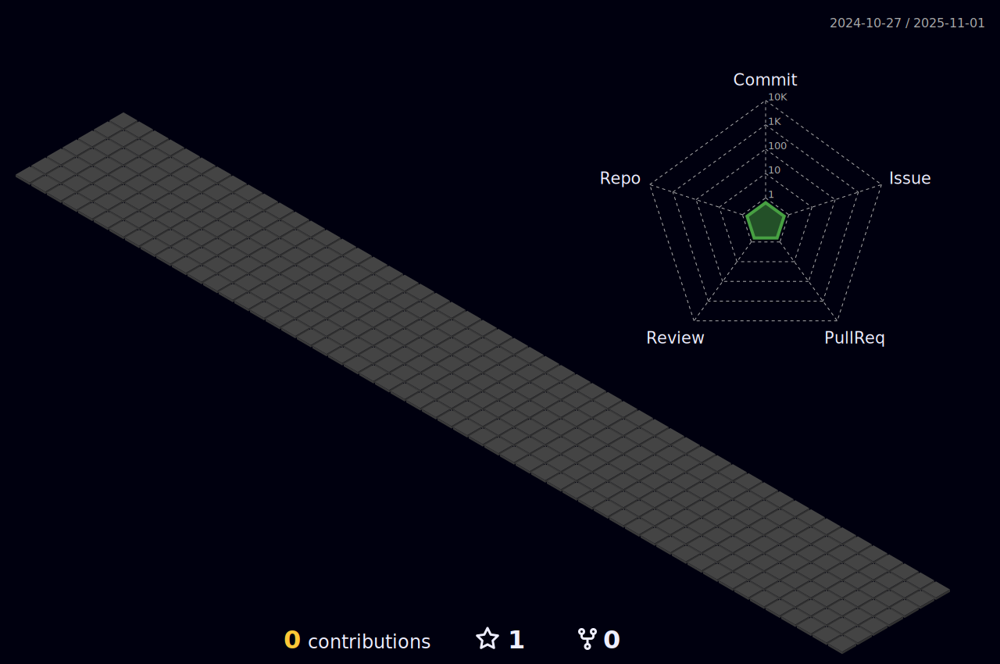

## 
### Hi there 👋

- 🚀  Developer in development
- 🎯  FullStack Developer

<a href="https://github.com/cristofermorera">

## 

### Tools and Technologies

###### Programming language

###### Front-end Frameworks

###### Back-end Frameworks

###### Database

###### Others

### Contacts

   

